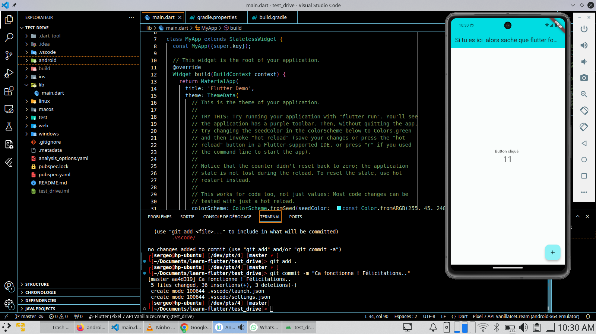

# test-flutter

Ceci est le projet hello world de test que je fais avec flutter

## Remerciement

Merci à tous, j'espere qu'au bout de mes efforts je vais maitriser le framework flutter et 
pouvoir developper des application android et ios.

## screenshot

Après mains essais ed builds, pendant trois jours où la connexion MTN/Orange et Camtel derangeaient au pays voici enfin que j'ai pu afficher et executer l'application dans un emulateur

